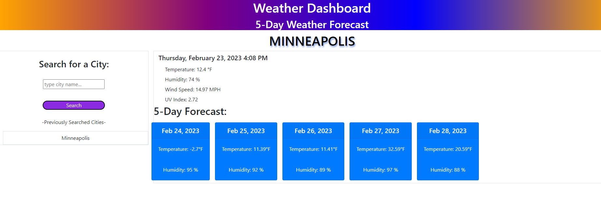

 # <weather-dashboard>

## Description

This is an interactive weather dashboard I created using third-party APIs.

While completing this project, I learned how to use bootstrap more effectively.

## Usage

Type in the name of the city you would like to see the current, and 5 day forecast for.

https://allstarcoding777.github.io/weather-dashboard/

## License

Please refer to the license in the repo.
